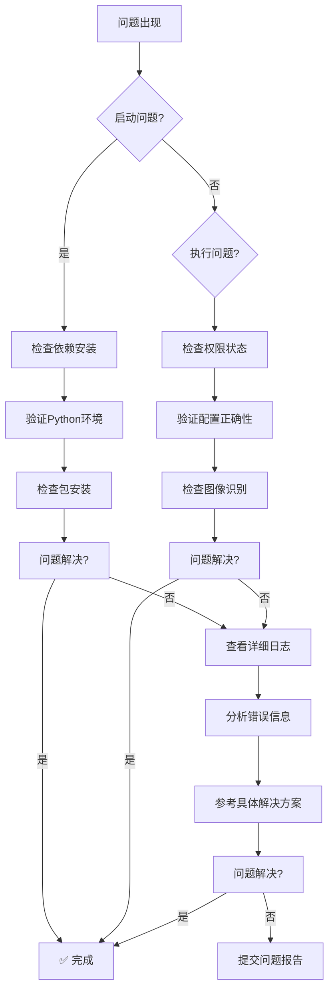

# 技能循环引擎 - 故障排除指南

## 快速诊断流程



## 常见问题分类

### 1. 启动和安装问题

#### 问题1.1：ModuleNotFoundError

**症状**：
```python
ModuleNotFoundError: No module named 'cv2'
ModuleNotFoundError: No module named 'pynput'
```

**原因**：缺少必要的Python包。

**解决方案**：
```bash
# 安装所有依赖
pip install opencv-python pynput watchdog

# 如果使用conda
conda install opencv pynput

# 验证安装
python -c "import cv2; import pynput; print('依赖安装成功')"
```

#### 问题1.2：Python版本不兼容

**症状**：语法错误或运行时错误。

**检查方法**：
```bash
python --version
# 应该显示 Python 3.8 或更高版本
```

**解决方案**：
- 下载并安装 Python 3.8+：https://www.python.org/downloads/
- 安装时勾选 "Add Python to PATH"

#### 问题1.3：文件路径错误

**症状**：`FileNotFoundError` 或配置文件读取失败。

**检查步骤**：
```python
import os
print("当前工作目录:", os.getcwd())
print("配置文件是否存在:", os.path.exists("./config/基本配置.json"))
```

**解决方案**：
- 确保在项目根目录运行程序
- 检查配置文件路径是否正确
- 使用绝对路径避免相对路径问题

### 2. 权限和系统问题

#### 问题2.1：按键操作无效

**症状**：技能识别正常，但没有按键操作。

**诊断命令**：
```python
from utils.权限控制 import 权限检查器
print("权限状态:", 权限检查器.获取系统权限状态())
```

**解决方案**：

**Windows系统**：
```cmd
# 以管理员身份运行命令提示符
# 然后运行程序
python 技能循环引擎.py
```

**Mac/Linux系统**：
```bash
# 使用sudo权限
sudo python 技能循环引擎.py
```

#### 问题2.2：屏幕访问权限被拒绝

**症状**：无法获取屏幕截图，图像识别失败。

**解决方案**：

**Windows**：
- 确保程序有屏幕录制权限
- 关闭杀毒软件的屏幕保护

**Mac**：
```bash
# 授予屏幕录制权限
sudo spctl --master-disable
# 然后在系统偏好设置 > 安全性与隐私 > 隐私中授权
```

**Linux**：
```bash
# 安装必要的工具
sudo apt-get install scrot
# 或使用其他截图工具
```

#### 问题2.3：操作频率限制

**症状**：程序运行一段时间后停止响应。

**诊断方法**：
```python
引擎 = 技能循环引擎(...)
状态 = 引擎.检查权限状态()
print("频率限制状态:", 状态["频率限制"])
```

**解决方案**：
- 增加操作间隔时间
- 调整频率限制规则
- 优化检测逻辑减少不必要的操作

### 3. 配置和设置问题

#### 问题3.1：配置文件格式错误

**症状**：JSON解码错误或配置读取失败。

**诊断工具**：
```python
import json

try:
    with open("config/基本配置.json", "r", encoding="utf-8") as f:
        配置 = json.load(f)
    print("配置文件格式正确")
except json.JSONDecodeError as e:
    print(f"JSON格式错误: {e}")
```

**解决方案**：
- 使用在线JSON验证器检查格式
- 确保使用UTF-8编码
- 检查逗号、引号等符号是否正确

#### 问题3.2：检测区域配置错误

**症状**：技能识别不准确或完全失败。

**调试方法**：
```python
from utils.调试工具 import 调试工具

调试器 = 调试工具()
# 显示检测区域
调试器.显示检测区域(检测区域, 屏幕图像)
```

**调整步骤**：
1. 使用截图工具获取准确坐标
2. 逐步调整检测区域大小
3. 测试不同区域的识别效果

#### 问题3.3：颜色配置不匹配

**症状**：技能状态判断错误。

**颜色检查工具**：
```python
# 获取实际颜色值
图像 = 图像接口.获取屏幕区域(检测区域)
实际颜色 = 图像.getpixel((x, y))
print(f"实际颜色: {实际颜色}")
print(f"配置颜色: {配置颜色}")
```

**解决方案**：
- 使用取色工具获取准确颜色值
- 考虑颜色容差设置
- 测试不同光照条件下的颜色

### 4. 性能和执行问题

#### 问题4.1：CPU使用率过高

**症状**：程序运行缓慢，系统响应变慢。

**性能优化建议**：

**代码层面**：
```python
# 增加检测间隔
引擎.设置检测间隔(0.2)  # 从0.1秒增加到0.2秒

# 启用图像缓存
class 优化图像获取器(图像获取接口):
    def __init__(self):
        self.缓存有效期 = 0.15  # 150毫秒缓存
```

**系统层面**：
- 关闭不必要的后台程序
- 增加系统虚拟内存
- 使用性能更好的硬件

#### 问题4.2：内存泄漏

**症状**：程序运行时间越长，内存占用越大。

**诊断工具**：
```python
import psutil
import os

进程 = psutil.Process(os.getpid())
print(f"内存使用: {进程.memory_info().rss / 1024 / 1024:.2f} MB")
```

**解决方案**：
- 定期清理缓存对象
- 使用弱引用管理大对象
- 检查循环引用问题

#### 问题4.3：响应延迟

**症状**：技能释放有明显延迟。

**性能分析**：
```python
引擎.设置日志级别("调试")
# 查看详细的时间统计
报告 = 引擎.获取性能报告()
print("性能报告:", 报告["性能报告"])
```

**优化措施**：
- 减少图像处理复杂度
- 优化算法逻辑
- 使用多线程处理

### 5. 图像识别问题

#### 问题5.1：技能识别不准确

**症状**：错误识别技能状态。

**调试步骤**：

**OpenCV版本**：
```python
# 调整匹配阈值
配置["全局配置"]["匹配阈值"] = 0.75  # 降低阈值提高容错

# 检查模板质量
import cv2
模板 = cv2.imread("./templates/技能名称.png")
print(f"模板尺寸: {模板.shape}")
print(f"模板质量: {cv2.mean(模板)}")
```

**颜色检测版本**：
```python
# 调整颜色容差
配置["技能名称"]["颜色容差"] = 10  # 增加容差范围

# 验证颜色检测
实际颜色 = 获取实际颜色()
配置颜色 = 配置["技能名称"]["颜色"]
容差 = 配置["技能名称"].get("颜色容差", 5)
匹配 = all(abs(a - b) <= 容差 for a, b in zip(实际颜色, 配置颜色))
print(f"颜色匹配: {匹配}")
```

#### 问题5.2：光照变化影响识别

**症状**：不同时间或环境下识别效果不同。

**解决方案**：

**自适应阈值**：
```python
def 自适应颜色检测(图像, 配置颜色, 基准亮度=128):
    # 计算当前图像平均亮度
    当前亮度 = 计算平均亮度(图像)
    
    # 根据亮度调整颜色阈值
    调整系数 = 当前亮度 / 基准亮度
    调整颜色 = [int(c * 调整系数) for c in 配置颜色]
    
    return 调整颜色
```

**多条件验证**：
```python
def 增强识别(图像, 技能配置):
    # 使用多个检测点
    点1颜色 = 图像.getpixel((x1, y1))
    点2颜色 = 图像.getpixel((x2, y2))
    
    # 综合判断
    匹配点1 = 颜色匹配(点1颜色, 技能配置["颜色1"])
    匹配点2 = 颜色匹配(点2颜色, 技能配置["颜色2"])
    
    return 匹配点1 and 匹配点2
```

### 6. 游戏兼容性问题

#### 问题6.1：游戏更新导致失效

**症状**：游戏更新后程序完全失效。

**应对策略**：

**快速适配**：
```python
# 创建配置版本管理
配置版本 = 配置.get("版本", "1.0.0")
游戏版本 = 获取游戏版本()

if 配置版本 != 游戏版本:
    print(f"配置版本 {配置版本} 与游戏版本 {游戏版本} 不匹配")
    print("需要更新配置文件")
```

**自动化检测**：
```python
def 检测游戏变化():
    # 检测界面元素变化
    关键元素 = 检测关键界面元素()
    
    if 关键元素发生变化:
        print("检测到游戏界面变化，需要调整配置")
        return False
    
    return True
```

#### 问题6.2：反作弊系统检测

**症状**：游戏检测到自动化操作。

**规避措施**：

**行为随机化**：
```python
import random
import time

def 随机化操作():
    # 添加随机延迟
    延迟 = random.uniform(0.05, 0.15)
    time.sleep(延迟)
    
    # 随机化操作顺序
    if random.random() < 0.1:  # 10%概率执行额外操作
        执行额外操作()
```

**人性化模式**：
```python
class 人性化操作器:
    def __init__(self):
        self.操作历史 = []
        self.最后一次操作时间 = 0
    
    def 执行操作(self, 操作):
        # 模拟人类操作间隔
        当前时间 = time.time()
        if 当前时间 - self.最后一次操作时间 < 0.1:
            time.sleep(0.1)  # 最小操作间隔
        
        # 记录操作历史
        self.操作历史.append((操作, 当前时间))
        self.最后一次操作时间 = 当前时间
```

## 高级调试技巧

### 实时调试模式

**启用详细日志**：
```python
引擎.设置日志级别("调试")

# 或者直接设置
import logging
logging.basicConfig(level=logging.DEBUG)
```

**性能监控**：
```python
# 实时监控性能
import time

开始时间 = time.time()
操作次数 = 0

while True:
    引擎.执行一次循环()
    操作次数 += 1
    
    if 操作次数 % 10 == 0:
        耗时 = time.time() - 开始时间
        print(f"平均响应时间: {耗时/操作次数:.3f}s")
```

### 可视化调试工具

**创建调试界面**：
```python
from utils.调试工具 import 调试工具

def 创建调试面板():
    调试器 = 调试工具()
    
    # 显示检测区域
    调试器.显示检测区域(检测区域, 屏幕图像)
    
    # 显示性能统计
    调试器.显示性能统计(引擎.获取性能报告())
    
    # 显示识别结果
    调试器.显示识别结果(识别数据)
```

### 自动化测试

**创建测试套件**：
```python
import unittest

class 技能引擎测试(unittest.TestCase):
    def setUp(self):
        self.引擎 = 创建测试引擎()
    
    def test_基本功能(self):
        # 测试基本循环功能
        结果 = self.引擎.执行一次循环()
        self.assertIsInstance(结果, bool)
    
    def test_性能基准(self):
        # 性能基准测试
        开始时间 = time.time()
        for i in range(100):
            self.引擎.执行一次循环()
        耗时 = time.time() - 开始时间
        
        self.assertLess(耗时, 10.0)  # 100次操作应在10秒内完成
```

## 紧急恢复措施

### 程序崩溃恢复

**创建守护进程**：
```python
import subprocess
import time

def 守护进程():
    while True:
        try:
            # 启动主程序
            进程 = subprocess.Popen(["python", "技能循环引擎.py"])
            
            # 等待程序结束
            返回码 = 进程.wait()
            
            if 返回码 == 0:
                print("程序正常退出")
                break
            else:
                print(f"程序异常退出，返回码: {返回码}")
                print("5秒后重启...")
                time.sleep(5)
                
        except Exception as e:
            print(f"守护进程错误: {e}")
            time.sleep(10)
```

### 配置备份和恢复

**自动备份配置**：
```python
import shutil
import datetime

def 备份配置():
    时间戳 = datetime.datetime.now().strftime("%Y%m%d_%H%M%S")
    备份路径 = f"./backup/config_backup_{时间戳}"
    
    shutil.copytree("./config", 备份路径)
    print(f"配置已备份到: {备份路径}")

def 恢复配置(备份时间戳):
    备份路径 = f"./backup/config_backup_{备份时间戳}"
    
    if os.path.exists(备份路径):
        shutil.rmtree("./config")
        shutil.copytree(备份路径, "./config")
        print("配置恢复成功")
    else:
        print("备份文件不存在")
```

## 获取帮助和支持

### 自助诊断工具

**创建诊断脚本**：
```python
#!/usr/bin/env python3
"""
技能循环引擎自助诊断工具
"""

import sys
import os

def 运行系统检查():
    print("=== 系统环境检查 ===")
    
    # 检查Python版本
    print(f"Python版本: {sys.version}")
    
    # 检查依赖包
    try:
        import cv2
        print("✅ OpenCV安装正常")
    except ImportError:
        print("❌ OpenCV未安装")
    
    # 检查配置文件
    if os.path.exists("./config"):
        print("✅ 配置目录存在")
    else:
        print("❌ 配置目录不存在")

if __name__ == "__main__":
    运行系统检查()
```

### 社区支持

**问题报告模板**：
```markdown
## 问题描述
[详细描述遇到的问题]

## 环境信息
- 操作系统: [例如 Windows 10]
- Python版本: [例如 3.8.10]
- 程序版本: [例如 v1.0.0]

## 错误日志
[粘贴完整的错误日志]

## 复现步骤
1. [步骤1]
2. [步骤2]
3. [步骤3]

## 预期行为
[描述期望的行为]

## 实际行为
[描述实际发生的行为]
```

---

通过本故障排除指南，您可以系统地诊断和解决技能循环引擎遇到的各种问题。如果问题仍然无法解决，请参考具体错误信息或联系技术支持。